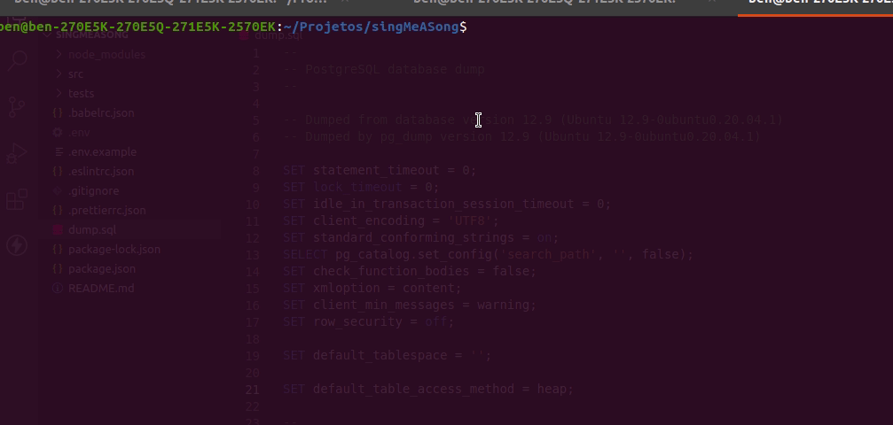

# API-Sing-me-a-Song

### - Clonar o repositorio
 

### - Instalar as dependencias

<blockquote>
  npm install
</blockquote>
 

### - Start:
<blockquote>
  npm run start:dev
</blockquote>

- Voce deve criar um arquivo .env como está no .env.example colocando os dados do banco 
{
    DB_NAME=singsong
    DB_USER=postgres
    DB_PASSWORD=123456
    DB_PORT=5432
    DB_HOST=localhost
    PORT=4000
}

### - unit tests:
<blockquote>
  num run start:test
</blockquote>

 